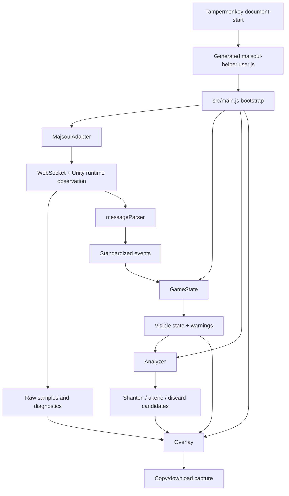
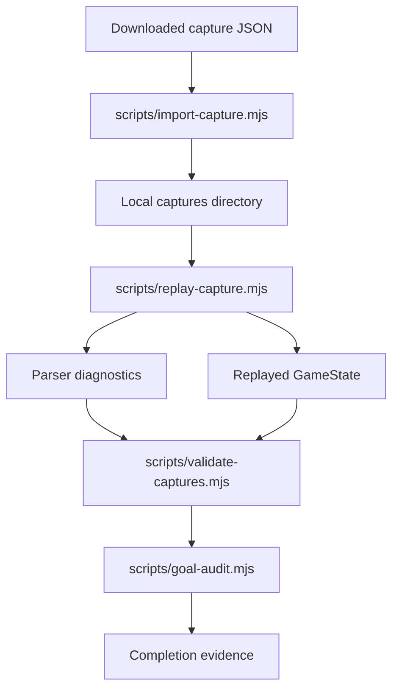
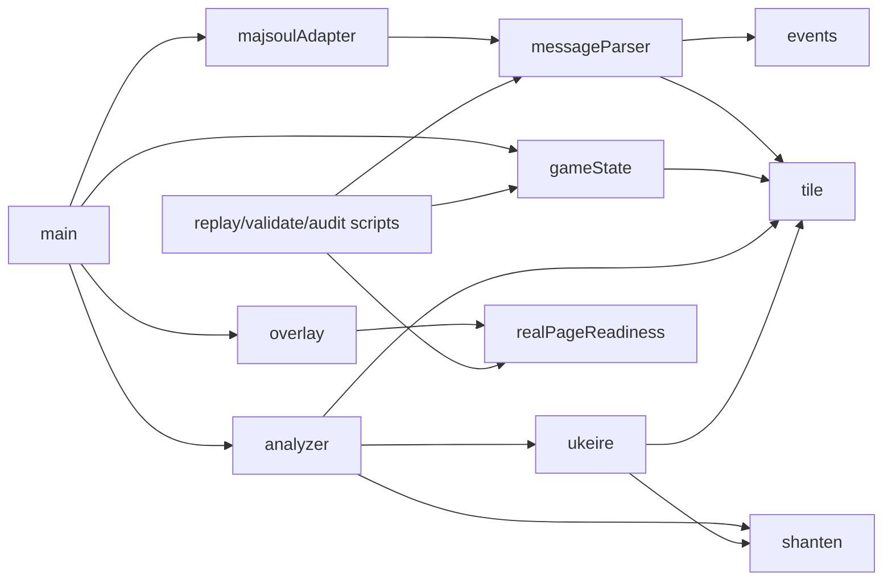

# ARCHITECTURE.md

## Directory Tree

```text
.
├── majsoul-helper.user.js        # generated Tampermonkey userscript
├── install.html                  # local install helper
├── smoke.html                    # browser smoke page
├── package.json                  # npm scripts and dev dependencies
├── README.md                     # user/developer overview
├── docs/
│   ├── AGENTS.md
│   ├── ARCHITECTURE.md
│   ├── CHANGELOG.md
│   ├── PROJECT_STATE.md
│   ├── TODO.md
│   └── real-page-sampling.md
├── src/
│   ├── main.js
│   ├── adapter/
│   │   ├── majsoulAdapter.js
│   │   └── messageParser.js
│   ├── core/
│   │   ├── analyzer.js
│   │   ├── events.js
│   │   ├── gameState.js
│   │   ├── realPageReadiness.js
│   │   ├── shanten.js
│   │   ├── tile.js
│   │   └── ukeire.js
│   └── ui/
│       ├── overlay.js
│       └── styles.js
├── scripts/
│   ├── build-userscript.mjs
│   ├── capture-doctor.mjs
│   ├── goal-audit.mjs
│   ├── import-capture.mjs
│   ├── replay-capture.mjs
│   ├── validate-captures.mjs
│   └── verify.mjs
└── tests/
    ├── *.test.js
    └── fixtures/
```

## Module Responsibilities

| Module | Responsibility |
| --- | --- |
| `src/main.js` | Compose adapter, state, analyzer, overlay, config, and global debug handle. |
| `src/adapter/majsoulAdapter.js` | Observe WebSocket/runtime traffic, buffer capture samples, invoke parser, export diagnostics. |
| `src/adapter/messageParser.js` | Convert raw/decoded Mahjong Soul messages into standardized helper events. |
| `src/core/events.js` | Define allowed standardized event types. |
| `src/core/gameState.js` | Apply events, maintain normalized visible state, emit consistency warnings. |
| `src/core/tile.js` | Parse/normalize/display tiles and convert to/from 34-index representation. |
| `src/core/shanten.js` | Calculate standard, seven-pairs, and thirteen-orphans shanten. |
| `src/core/ukeire.js` | Calculate effective tile types and remaining counts. |
| `src/core/analyzer.js` | Analyze current hand and discard candidates. |
| `src/core/realPageReadiness.js` | Define safety, preflight, and capture verification criteria. |
| `src/ui/overlay.js` | Render overlay controls, state, analysis, debug events, and capture export. |
| `src/ui/styles.js` | Provide overlay styling. |
| `scripts/*.mjs` | Build, replay, validate, audit, import, and verify workflows. |

## Runtime Data Flow



## Replay and Verification Flow



## Key Dependencies



## Boundary Notes

- Adapter may observe and record; it must not mutate outbound game traffic.
- Parser may decode supported payloads; it must not invent missing fields.
- GameState owns state consistency; UI should not patch state directly.
- Analyzer consumes state snapshots only; it should not know about Mahjong Soul transport details.
- Overlay renders and exports diagnostics; it should not contain core mahjong logic.
